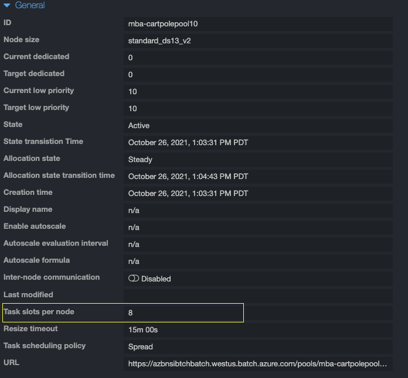

# Batch Orchestration for Bonsai Simulations

## Overview

You've found the `bonsai-batch` framework. Here you'll find a set of tools to assist you in scaling out simulators using Azure Batch. Note, while this was developed with Bonsai in mind, it's a general framework for running tasks on Azure Batch using its Python SDK.

⚠️ **Disclaimer**: This is not an official Microsoft product. This application is considered an experimental addition to Microsoft Project Bonsai's software toolchain. It's primary goal is to reduce barriers of entry to use Project Bonsai's core Machine Teaching, and no warranties are provided for its use.

### Prerequisites

1. An Azure account.
2. Bonsai workspace. You can find instructions on provisioning a [bonsai workspace here](https://docs.microsoft.com/en-us/bonsai/guides/account-setup).
3. Anaconda or [miniconda](https://docs.conda.io/en/latest/miniconda.html).
4. Create a virtual environment with libraries dependencies (described in environment.yml file)

```shell
conda env create -f environment.yml
conda activate bonsai-batch
```

## Quick Start

- Create your resources: `python batch_creation.py create_resources`
- Build your image: `python batch_creation.py build_image`
- Run your tasks: `python batch_containers.py run_tasks`
- Create your brain and start training: `bonsai brain version start-training --name <brain-name>`
- Attach your simulators: `bonsai simulator unmanaged connect -b <brain-name> -a Train -c <concept_name> --simulator-name <simulator-name>`

## Scaling Simulators Using Azure Batch and Azure Container Registry

There are two executable scripts in this repository:

1. `batch_creation.py` -> creates the necessary resources on Azure to scale your simulations: Azure Batch, Azure Container Registry, and Azure Blob Storage, all within a single resource group.
    - **NOTE**: Resources may contain only lowercase alphanumeric characters, and must be between 3 and 25 characters in length.
2. `batch_containers.py` -> executes a set of simulation jobs as a set of tasks on the Azure Batch account you created in step 1.

Both of these scripts rely on the [`fire`](https://google.github.io/python-fire/) package to execute the scripts. To view how to use these scripts you are recommended to view their associated arguments and documentation:

```bash
python batch_creation.py -h
NAME
    batch_creation.py

SYNOPSIS
    batch_creation.py GROUP | COMMAND

GROUPS
    GROUP is one of the following:

     configparser
       Configuration file parser.

     pathlib

     re
       Support for regular expressions (RE).

     Dict
       The central part of internal API.

     Union
       Internal indicator of special typing constructs. See _doc instance attribute for specific docs.

     fire
       The Python Fire module.

COMMANDS
    COMMAND is one of the following:

     get_default_cli

     azure_cli_run
       Run Azure CLI command

     AzCreateBatch

     AzExtract

     AcrBuild

     delete_resources
       Delete resource group

     write_azure_config

     create_resources
       Main function to create azure resources and write out credentials to config file

     build_image
       Build ACR image from a source directory containing a dockerfile and src files.


python batch_containers.py -h
NAME
    batch_containers.py

SYNOPSIS
    batch_containers.py GROUP | COMMAND

GROUPS
    GROUP is one of the following:

     configparser
       Configuration file parser.

     datetime
       Fast implementation of the datetime type.

     pathlib

     sys
       This module provides access to some objects used or maintained by the interpreter and to functions that interact strongly with the interpreter.

     time
       This module provides various functions to manipulate time values.

     List
       The central part of internal API.

     batch_auth

     batch

     batchmodels

     blobxfer

     fire
       The Python Fire module.

     xfer_utils
       Run and scale simulation experiments on Azure Batch.

COMMANDS
    COMMAND is one of the following:

     AzureBatchContainers

     run_tasks
       Run simulators in Azure Batch.

     stop_job

     upload_files
       Upload files into attached batch storage account.

```

While there are a lot of different functions exposed, the most common usage only relies on two of them from `batch_creation`, and one from `batch_containers`:

1. `python batch_creation.py create_resources`
    - create the resources you need for orchestrating tasks on Azure Batch. If you already have some resources created (e.g., a resource group) you can pass their names directly: `python batch_creation.py create_resources --rg=<existing-rg> --loc=<location-of-resources>` (⚠️: if your resource group exists in different location from your other resources you'll need to pass a location parameter for it separately: `python batch_creation.py create_resources --rg=<existing-rg> --rg_loc=<rg_location> --loc=<all-other-resources-loc>`).
2. `python batch_creation.py build_image --image-name <image-name>`
    - build your Docker image on Azure Container Registry
    - ⚠️ : if your image is very large you may need to increase the `--timeout` parameter to avoid the script from timing out when buidling the image. If you still encounter issues while creating and pushing the image you may prefer building the image locally and pushing using `docker push`, > `docker tag`, and `docker push`.
3. `python batch_containers.py run_tasks`
    - run your batch pool

### Already Built Resources, Just Write them to the Config File 📝

If you already have a resource-group, ACR repository, storage, and a Batch account, you can use the `write_azure_config` function to write out the credentials to a config file rather than creating new resources:

```bash
python batch_creation.py write_azure_config \
	--rg=my-beautiful-rg \
	--batch=has-a-batch-account \
	--acr=and-acr-registyr \
	--store=plus-storage! \
	--loc=in-this-location
```

## Comments on Usage

The main advantage of this repository is it streamlines the process of scaling simulators using Azure Container Registry with Docker images. The only thing the user needs to do is write a Dockerfile containing their source code for running the simulator. In most cases, this is a very simple Docker image, and hence the Dockerfile is very concise. Building and running the image is done entirely using Azure Container Registry, which means you don't even need to install Docker locally!

## Scaling Number Of Sims, Number Of Tasks And Number Of Instances In A Pool

To specify the number of nodes in the pool, define the following arguments:

```
python batch_containers.py run_tasks --dedicated-nodes=<#_of_dedicated nodes> --low-pri-nodes=<#_of_lo_pri_nodes>
```

The number of tasks per node will be automatically deduced as number_of_sims/(number_low_pri_nodes + number_dedicated_nodes). You can view this parameter by inspecting your pool's configuration and the value of `Task slots per node`:



### How to Delete an Existing Pool

Note, deleting pools is the best way to completely ensure you don't run into additional costs once the brain training has completed.

In order to delete from command line, you have the following options:
- Delete last created pool: `python batch_containers.py delete_pool`.
- Delete specific pool: `python batch_containers.py delete_pool --pool_name="pool-name"`.
- Delete all pools within last created resource: `python batch_containers.py delete_pool --delete-all=True`.

If you want to see and/or manage your current pools through Azure, you can follow the following steps:
1. Search for the Resource Group you selected when running `python batch_creation.py create_resources`.
2. On Overview tab, click over the item name with TYPE "Batch Account" (by default: "<your_group_name>batch").
3. On left pane, on 'Features' section, click over 'Pools'.
4. You can now see a drop down with the list of previously created pools.

### Note About Modifying An Existing Pool

If you want to resize an existing pool, use the function `resize_pool`

```
python batch_containers.py resize_pool --low_pri_nodes <new-low-pri-node-count> --dedicated_nodes <new-dedicated-node-count>
```

If you would like to modify the pool altogether, perhaps so that it uses a new image, then delete the pool first and run new tasks on the new pool:

```
python batch_containers.py delete_pool --pool_name <pool-to-delete>
python batch_containers.py run_tasks
```

### Building Windows Containers

The `build_image` function contains a few arguments for specifying the platform, image name, as well as the docker path. Here is an example of specifying a windows platform version with a different Dockerfile location:

```bash
python batch_creation.py build_image \
  --docker_folder=examples/cs-house-energy \
  --dockerfile_path=Dockerfile-windows \
  --platform=windows --image_name=winhouse
```

After building, you can run your tasks with the specific image you've created:

```bash
python batch_containers.py run_tasks --image_name=winhouse
```

### Mounting and Accessing Azure Fileshares

You can also mount an Azure Fileshare and access it from your container. This can be useful if you want to write logs to a persistent storage facility or need to access files located on an external storage system when running your containers.

If you want ot use Azure Fileshare, you need to ensure that `create_fileshare=True` during resource creation, i.e.,

```bash
python batch_creation.py create_resources --create_fileshare=True
```

Second, when running your containers you need to set `log_iterations=True`, i.e.,

```bash
python batch_containers.py run_tasks --log_iterations=True
```

This ensures your batch pool mounts the Azure Fileshare during pool creation. The fileshare will be mounted to the path `azfiles` under your mount directory. You can access the fileshare by utilizing the environment variable `$AZ_BATCH_NODE_MOUNTS_DIR`/`azfiles` (mount directory + path) (see [here] for more information on how directories are structured in your batch pools). For example, you may choose to log iterations using the following command:

```bash
> python batch_containers.py run_tasks --log_iterations=True
Please enter task to run from container (e.g., python main.py): python main.py --log-iterations --log-path="$AZ_BATCH_NODE_MOUNTS_DIR""azfiles"/"cartpole-logs"
```

This will log the iterations to the directory `cartpole-logs` in your Azure Fileshare.

For linux, the value of `$AZ_BATCH_NODE_MOUNTS_DIR` is typically `/mnt/batch/tasks/fsmounts/`, so you can also manually specify the entire path rather than using the environment variable (for instance if you cannot pass the environment variable during your command).

⚠️ If you are logging from each of your containers you should try and ensure the filename is unique for each container to avoid clashes between logs from different containers.

### Installation

There is currently no updated `batch_orchestration` package. The best way to use this package is to install the bonsai-batch conda environment (Follow this [link](https://docs.conda.io/en/latest/miniconda.html) if you need to install conda):

```bash
conda update -n base -c defaults conda
conda env update -f environment.yml 
conda activate bonsai-preview
```

This provides the exact versions of the packages and python environment we used to test this library and therefore will give you the highest chance of success.

The first time you use this package you'll also need to login to azure and set your subscription appropriately:

```bash
az login
az account list -o table
az account set -s <subscription-id>
```

## Testing Docker Images

The only caveat is if you need to debug your Docker image, you will need to install Docker locally (or write a batch script to run on ACR, which is a pretty inefficient method of debugging). For example, after running the `batch_creation` script above, you could test your image by:


```bash
docker login azhvacacr.azurecr.io
# your username and password are available in the newconf.ini file
docker pull azhvacacr.azurecr.io/hvac:1.0
docker run -it azhvacacr.azurecr.io/hvac:1.0 bash
```

## Reasons Your Unmanaged Sims May Become Unregistered

Simulators may unregister from the Bonsai platform for any of the following reasons:

- Software update to Bonsai platform
- WaitForState timeout
- WaitForAction timeout

When using managed simulators, the platform will automatically re-register and connect sims when they unregister. When using unmanaged simulators, such as with the `bonsai-batch` scripts, the user is responsible for registering the simulators again. To aid this effort, the [`reconnect.py`](./reconnect.py) with the following flags to repeatedly look for sims with an `Unset` purpose and connect those specific session-id's back with your brain.

```bash
python reconnect.py --simulator-name HouseEnergy --brain-name 20201116_he --brain-version 1 --concept-name SmartHouse --interval 1
```

## Contributing

This project welcomes contributions and suggestions.  Most contributions require you to agree to a
Contributor License Agreement (CLA) declaring that you have the right to, and actually do, grant us
the rights to use your contribution. For details, visit https://cla.opensource.microsoft.com.

When you submit a pull request, a CLA bot will automatically determine whether you need to provide
a CLA and decorate the PR appropriately (e.g., status check, comment). Simply follow the instructions
provided by the bot. You will only need to do this once across all repos using our CLA.

This project has adopted the [Microsoft Open Source Code of Conduct](https://opensource.microsoft.com/codeofconduct/).
For more information see the [Code of Conduct FAQ](https://opensource.microsoft.com/codeofconduct/faq/) or
contact [opencode@microsoft.com](mailto:opencode@microsoft.com) with any additional questions or comments.

## Trademarks

This project may contain trademarks or logos for projects, products, or services. Authorized use of Microsoft 
trademarks or logos is subject to and must follow 
[Microsoft's Trademark & Brand Guidelines](https://www.microsoft.com/en-us/legal/intellectualproperty/trademarks/usage/general).
Use of Microsoft trademarks or logos in modified versions of this project must not cause confusion or imply Microsoft sponsorship.
Any use of third-party trademarks or logos are subject to those third-party's policies.
